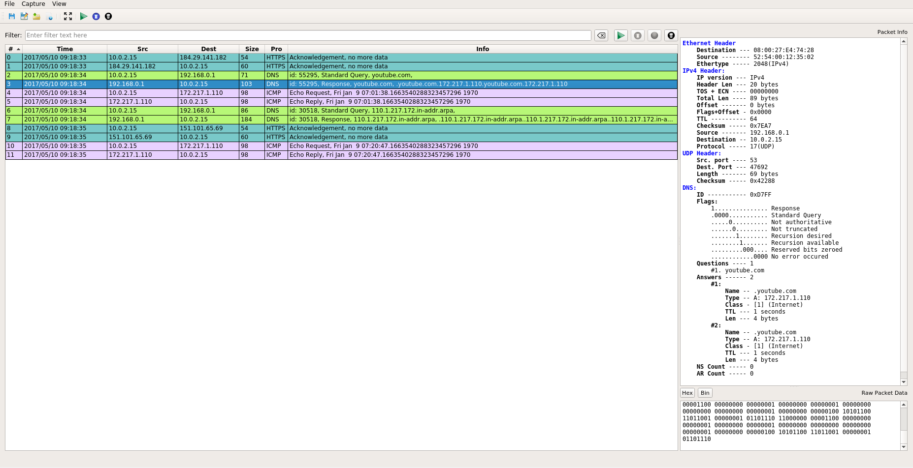

# PacketSniffer
A simple packet sniffer written in fall 2015 using Qt for the gui and Pcap to sniff ethernet packets.
Originally written in pure C as a command line application, then adapted into a GUI application.
Can save, pause, resume, open, and delete captures.

Demonstrates knowledge of networking layers and protocols.

Has support for following Protocols:
+ Layer 2 - Data Link Layer:
	+ Ethernet
	+ ARP

+ Layer 3 - Network Layer:
	+ ICMP
	+ IPv4 and IPv6

+ Layer 4 - Transport Layer:
	+ TCP
	+ UDP

+ Layer 7 - Application Layer:
	+ DNS
	+ HTTP
	+ HTTPS

## Dependencies:
Depends on the following packages:
+ libpcap-dev
+ qt5

## Compiling:
Please install by importing the PacketSniffer.pro file into QtCreator, building it,then navigating to the build directory and running the executable using:

sudo ./PacketSniffer

If there is an error in the status bar at the bottom of the window when starting capture, please edit the ETHERNET_DEVICE string in shared.h (use the command "ifconfig" to view your ethernet device names) and recompile (sorry for how crude this method is, cut me some slack I made it years ago).

## Sample Captures:

